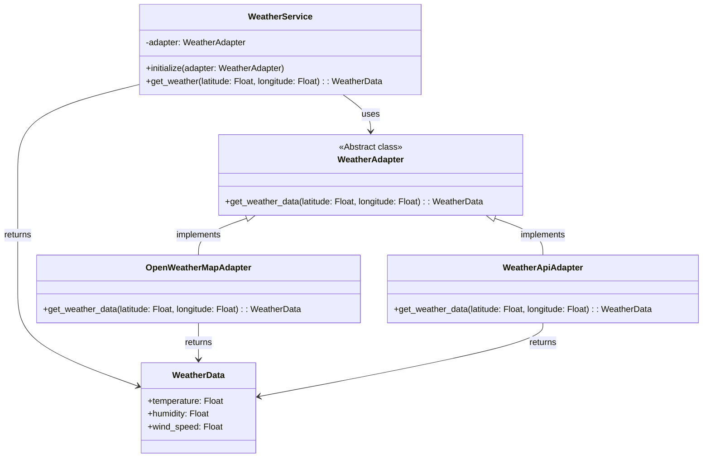

# Weather Service Adapter

Этот проект демонстрирует использование паттерна Адаптер для получения данных о погоде из различных источников.

## Структура проекта

- `main.rb`: Основной файл для запуска приложения
- `weather_service.rb`: Содержит классы для сервиса погоды, адаптеров и данных о погоде

## Классы

- `WeatherService`: Основной сервис для получения погоды
- `WeatherAdapter`: Абстрактный класс адаптера
- `OpenWeatherMapAdapter`: Адаптер для OpenWeatherMap API
- `WeatherApiAdapter`: Адаптер для WeatherApi
- `WeatherData`: Класс для хранения данных о погоде

## Использование

```
ruby main.rb
```

## Диаграмма классов


