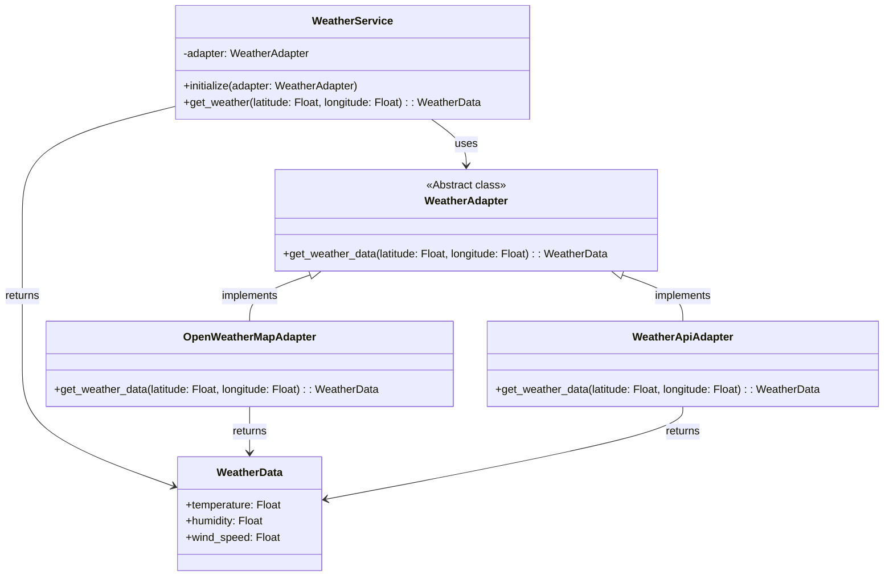

# Class Diagramm

```mermaid
classDiagram
    class WeatherService {
        +initialize(adapter: WeatherAdapter)
        +get_weather(latitude: Float, longitude: Float): WeatherData
        -adapter: WeatherAdapter
    }

    class WeatherAdapter {
        <<Abstract class>>
        +get_weather_data(latitude: Float, longitude: Float): WeatherData
    }

    class OpenWeatherMapAdapter {
        +get_weather_data(latitude: Float, longitude: Float): WeatherData
    }

    class WeatherApiAdapter {
        +get_weather_data(latitude: Float, longitude: Float): WeatherData
    }

    class WeatherData {
        +temperature: Float
        +humidity: Float
        +wind_speed: Float
    }

    WeatherService --> WeatherAdapter : uses
    WeatherAdapter <|-- OpenWeatherMapAdapter : implements
    WeatherAdapter <|-- WeatherApiAdapter : implements
    WeatherService --> WeatherData : returns
    OpenWeatherMapAdapter --> WeatherData : returns
    WeatherApiAdapter --> WeatherData : returns
```
